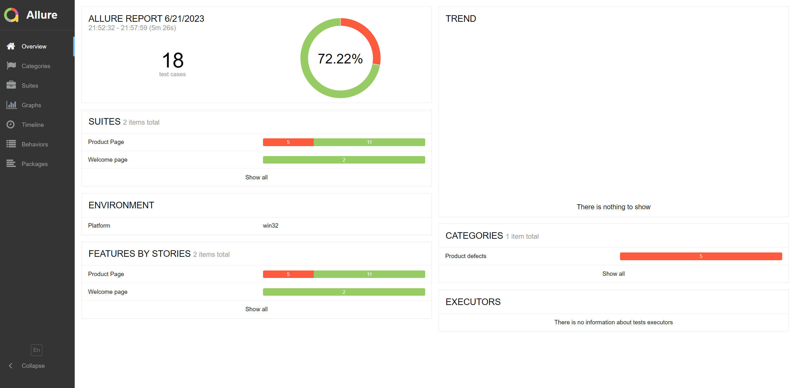

# WebdriverIO TypeScript BDD Cucumber Framework

## Test Coverage

```
- Welcome page:
  - Content on welcome page should be the same every time navigate to (@test8) -> PASS
  - Can navigate to product page from welcom page (@test9) -> PASS

- Product page:
  - Filter with all column and operator will return correct data (@test1, @test5) -> PASS
  - Every product should belong to at least 1 category (@test2) -> PASS
  - Every pro duct should have correct structure (@test3) -> FAIL
  - None of the products have multiple occurrences of the same category (@test4) -> FAIL
```

## Requirements:

[](https://nodejs.org/en/download/)
[](https://www.oracle.com/java/technologies/downloads/)
[](https://code.visualstudio.com/download)

## Install the dependencies:

```
yarn install
```

## Run tests:

```
Acceptance test:
  - yarn acceptance-test
  - yarn acceptance-test --headless (run in headless mode)

API test:
 - yarn api-test (api test default run in headless mode)

Run with specific tag:
 - yarn acceptance-test --cucumberOpts.tagExpression=@test1
 - yarn api-test --cucumberOpts.tagExpression=@test8
```

## Generate html report

```
yarn report
```

## Key Features

    - Cucumber BDD framework
    - Page Object Design pattern
    - Axios API Integration
    - Allure Report
    - File/Folder utilities

## Sample report


